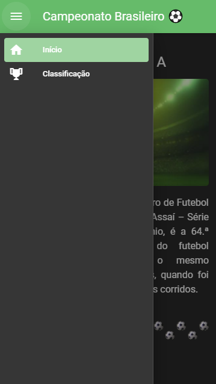
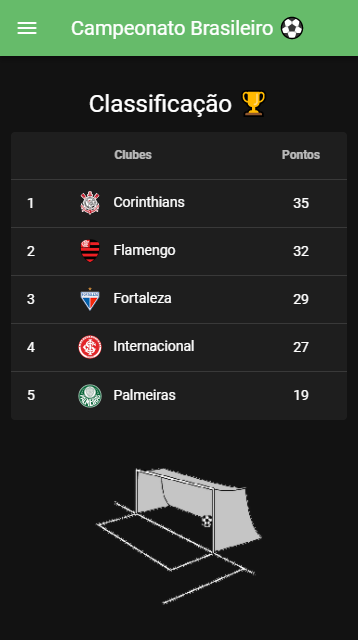

# Projeto/Aprendizagem - Hackathon Decola Iteris || Kepler

Desenvolvimento de uma SPA [ Aplicação de Página Única ] para conhecimento das ferramentas essenciais do hackathon: VueJs + Vuetify.

# campeonato-brasileiro

## Project image

    
  
## Project setup
```
npm install
```

### Compiles and hot-reloads for development
```
npm run serve
```

### Compiles and minifies for production
```
npm run build
```

### Lints and fixes files
```
npm run lint
```

### Customize configuration
See [Configuration Reference](https://cli.vuejs.org/config/).
